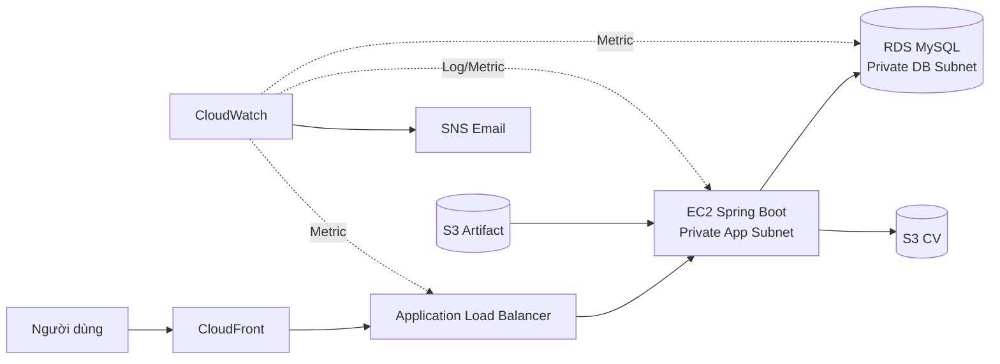

## Kiến trúc tổng thể

## Dịch vụ và lý do lựa chọn

| Dịch vụ | Vai trò | Lý do lựa chọn |
|---|---|---|
| VPC | Cô lập mạng | Chia public, application và database tier rõ ràng |
| ALB | Điểm vào HTTP | Health check, cân bằng tải và hỗ trợ mở rộng nhiều EC2 |
| EC2 | Chạy Spring Boot | Phù hợp ứng dụng JAR hiện có và cho phép kiểm soát OS |
| RDS MySQL | Cơ sở dữ liệu | Tự động backup, patching và giám sát |
| S3 | Lưu CV/artifact | Bền vững, chi phí thấp, tích hợp IAM |
| CloudFront | CDN | HTTPS mặc định, edge cache và che giấu ALB khỏi người dùng |
| CloudWatch/SNS | Quan sát và cảnh báo | Tập trung log, metric, alarm và email |

## Nguyên tắc thiết kế

- Chỉ ALB/NAT nằm trong public subnet; EC2 và RDS không có public IP.
- RDS chỉ nhận TCP 3306 từ Security Group của EC2.
- EC2 chỉ nhận cổng ứng dụng từ Security Group của ALB.
- Quyền truy cập S3 được cấp qua IAM Role, không lưu access key trên máy chủ.

Tiếp tục theo thứ tự từ **5.4 đến 5.12** để triển khai, kiểm thử, giám sát và dọn dẹp.
